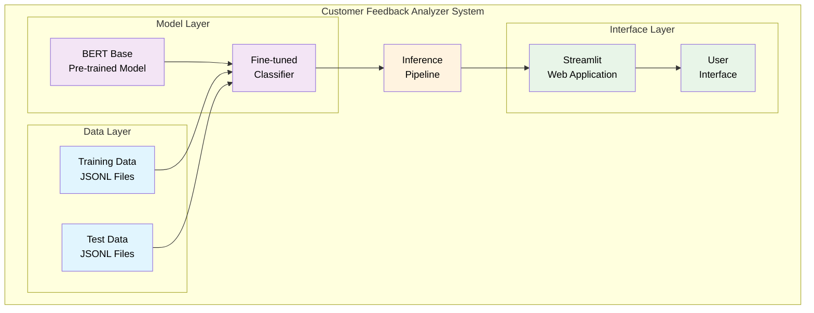
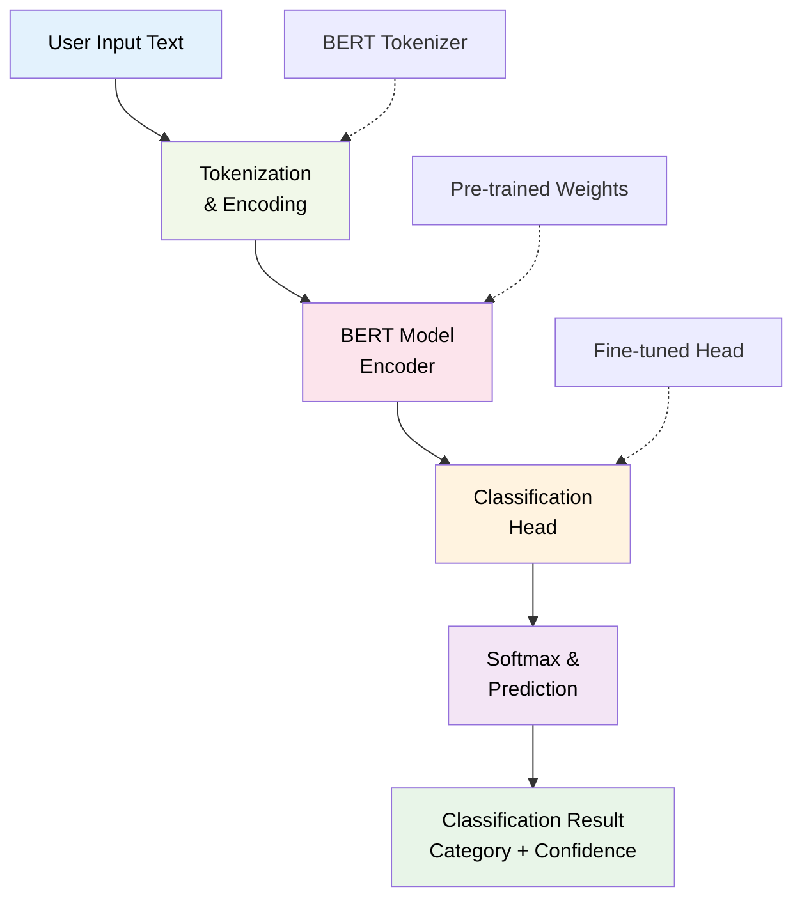
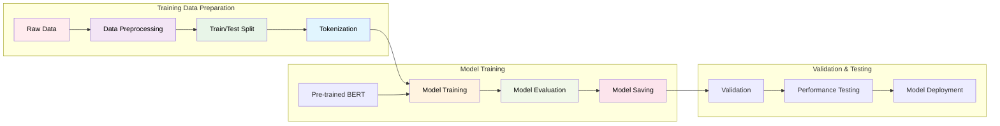
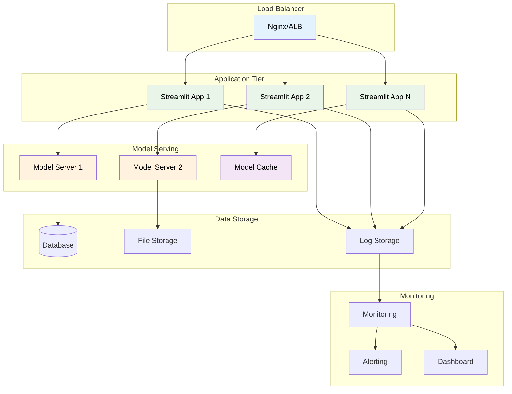
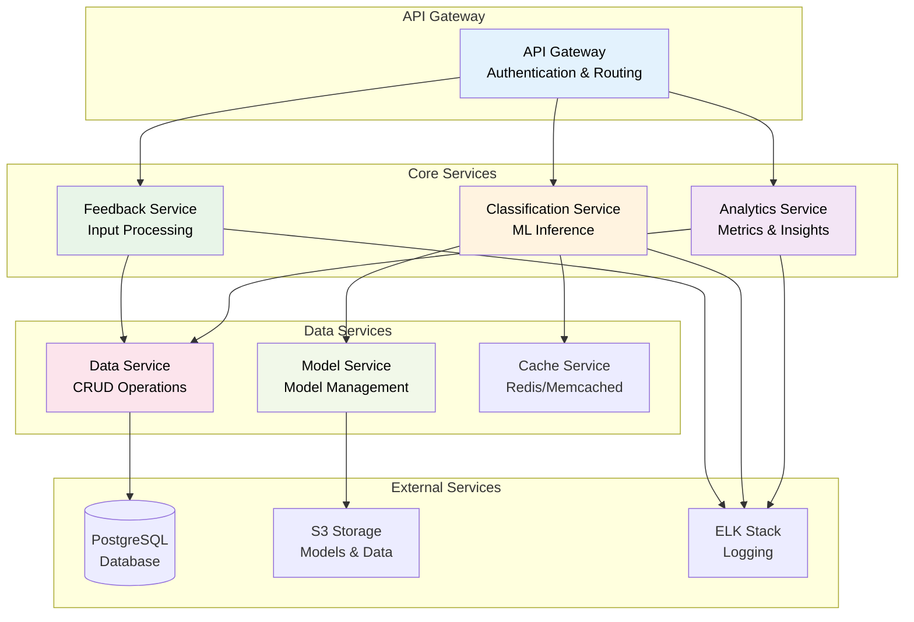
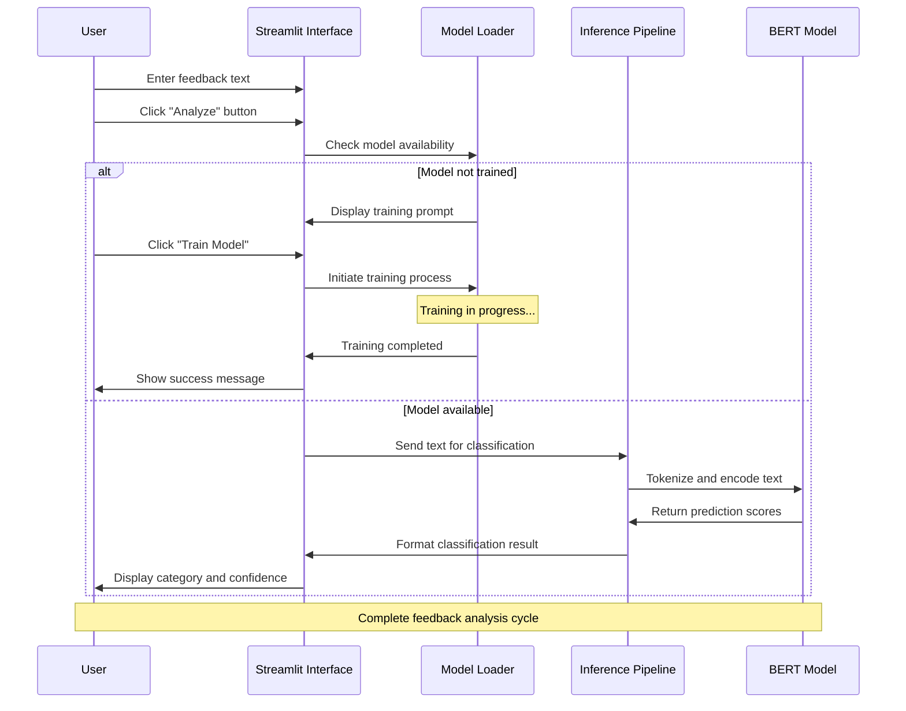
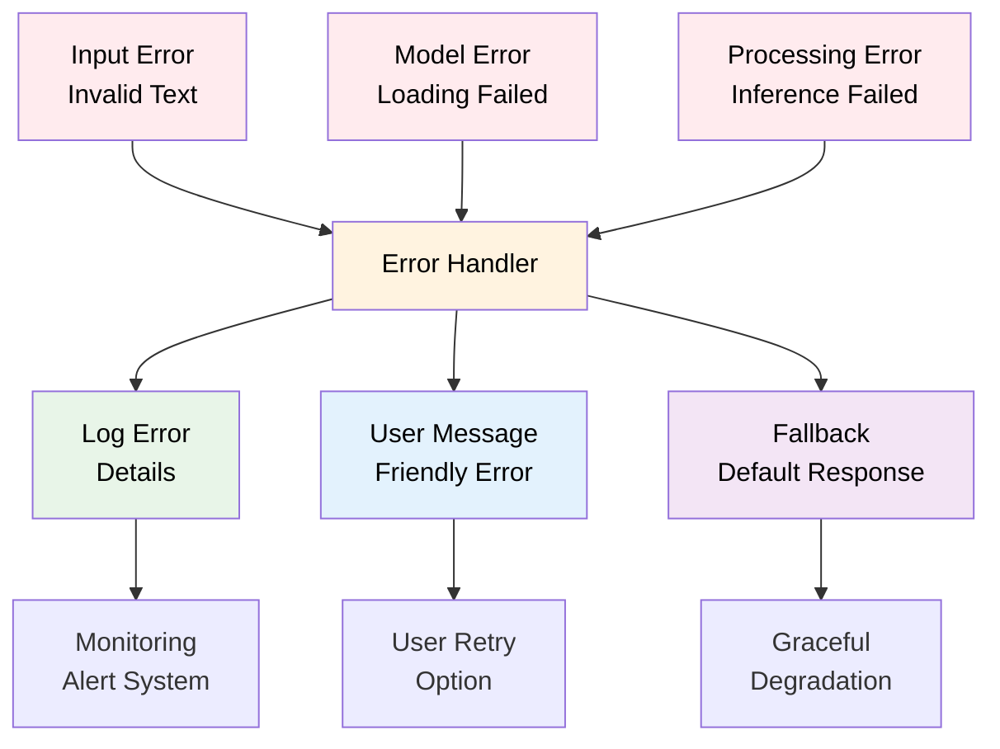

# Customer Feedback Analyzer - AI-Powered Classification System

## Project Title

**Customer Feedback Analyzer: Intelligent Classification System using Hugging Face Transformers**

## Project Description

The Customer Feedback Analyzer is an advanced Natural Language Processing (NLP) application that automatically classifies customer feedback into actionable categories using state-of-the-art transformer models from Hugging Face. Think of it as an AI assistant that can read customer comments and instantly understand what type of feedback it is - whether it's a bug report, feature request, complaint, or praise.

The system leverages BERT-based models (a type of AI that's really good at understanding text) fine-tuned on customer feedback data to provide real-time classification with high accuracy. It's like teaching a computer to read and categorize feedback just like a human customer service representative would, but much faster!

### Key Features:

- **Automated Classification**: Instantly categorizes feedback into 8 distinct categories
- **Interactive Web Interface**: User-friendly Streamlit application for real-time analysis
- **Model Fine-tuning**: Custom training pipeline using Hugging Face Transformers
- **Performance Comparison**: Built-in model evaluation and comparison tools
- **Real-time Feedback Loop**: Interactive training with user corrections
- **Scalable Architecture**: Designed for enterprise-level deployment

### Classification Categories:

1. 🐞 **Bug Report** - Technical issues and software defects
2. 💡 **Feature Request** - New functionality suggestions
3. 🎉 **Praise** - Positive feedback and compliments
4. 😠 **Complaint** - Negative feedback and dissatisfaction
5. ❓ **Question** - User inquiries and help requests
6. 💡 **Usage Tip** - User-generated tips and tricks
7. 📄 **Documentation** - Documentation-related feedback
8. 🔖 **Other** - General feedback not fitting other categories

## Project File Structure

Here's how the project is organized - think of it like a well-organized filing cabinet where everything has its place:

```
hugging_face_model_deployment_and_fine_tuning/
├── code/
│   └── customer-feedback-analyzer/
│       ├── app.py                          # 🎨 Main Streamlit web application for interactive feedback analysis
│       ├── inference.py                    # 🧠 AI model inference engine for real-time classification
│       ├── finetune_classifier.py          # 🎓 Model training script for BERT fine-tuning
│       ├── test.py                         # 🧪 Testing and validation script for model evaluation
│       ├── compare_models.py               # 📊 Model performance comparison utility
│       ├── split_train_test.py             # ✂️ Data splitting utility for train/test dataset creation
│       ├── requirements.txt                # 📦 Python dependencies and package versions
│       ├── sample_feedbacks.txt            # 📝 Example feedback samples for testing purposes
│       ├── data/                           # 📊 Training and test data directory
│       │   ├── feedback_classify_train.jsonl   # 🎯 Training dataset with labeled feedback examples
│       │   └── feedback_classify_test.jsonl    # 🧪 Test dataset for model evaluation
│       ├── models/                         # 🤖 Trained AI models storage (auto-created during training)
│       │   └── feedback_classifier/        # 🧠 Fine-tuned BERT model and tokenizer files
│       └── __pycache__/                    # 🗂️ Python bytecode cache directory (auto-generated)
├── assets/                                 # 🖼️ Images and multimedia documentation assets
│   ├── ai_interface_engine.png             # 📸 AI inference engine code visualization
│   ├── app_code_snippet.png               # 📸 Streamlit application code screenshot
│   ├── architecture.png                   # 📸 System architecture diagram
│   ├── batch_mode.png                     # 📸 Batch processing interface screenshot
│   ├── batch_mode_logs.png                # 📸 Batch processing logs visualization
│   ├── batch_mode_output.png              # 📸 Batch processing results display
│   ├── dashboard.png                      # 📸 Application dashboard interface
│   ├── data_processing_flow.png           # 📸 Data processing pipeline diagram
│   ├── demo_video.mp4                     # 🎥 Complete system demonstration video
│   ├── finetune_classifier_code_snippet.png # 📸 Model training code implementation
│   ├── inference_code snippet.png         # 📸 Inference pipeline code visualization
│   ├── logs.png                           # 📸 System logging interface screenshot
│   ├── mobile_responsive_view.png         # 📸 Mobile-responsive design demonstration
│   ├── model_training.png                 # 📸 Model training pipeline visualization
│   ├── output_interface.png               # 📸 Results output interface design
│   ├── streamlit_interface.png            # 📸 Main Streamlit web interface
│   └── training_pipeline.png              # 📸 Complete training workflow diagram
├── documentation/                         # 📚 Comprehensive project documentation
│   ├── API_REFERENCE.md                   # 📋 Complete API documentation and function references
│   ├── DOCUMENT.md                        # 📖 Main project documentation (this file)
│   ├── IMAGE_DESCRIPTIONS.md              # 🖼️ Detailed descriptions of all project images
│   ├── PROJECT_INDEX.md                   # 📇 Project file index and navigation guide
│   ├── SETUP.md                           # ⚙️ Installation and setup instructions
│   └── TROUBLESHOOTING.md                 # 🔧 Common issues and solutions guide
├── interview_preparation_material/        # 🎯 Interview and career preparation resources
└── research_supplement_material/          # 📚 Additional research papers and learning materials
└── README.md                              # 📖 Project overview and quick start guide
```

### What Each File Does?

- **app.py**: This is your main application - like the front door to your AI system. It creates a beautiful web interface where users can type feedback and see instant classifications.

- **inference.py**: This is the "thinking" part of your AI. When someone submits feedback, this file processes it and returns the classification.

- **finetune_classifier.py**: This is like a teacher for your AI. It takes a general AI model and teaches it specifically about customer feedback.

- **compare_models.py**: This helps you see how well your trained AI performs compared to a basic AI model - like comparing test scores.

- **data/ folder**: Contains your training examples - think of it as textbooks for your AI to learn from.

- **models/ folder**: Stores your trained AI models - like graduated students ready to work.

## Why This Project is Relevant for Your Portfolio

### 1. **Industry-Critical Skills Demonstration**

- **Machine Learning Engineering**: Shows you can build complete AI systems from start to finish
- **NLP Expertise**: Proves you understand how to make computers understand human language
- **Model Deployment**: Demonstrates you can create real applications people can actually use
- **Data Science**: Shows you know how to work with data and measure performance

### 2. **Modern Technology Stack**

- **Hugging Face Ecosystem**: The industry standard for AI language models (like the iPhone of AI)
- **PyTorch Integration**: The most popular framework for building AI models
- **Streamlit**: Makes it easy to create beautiful web apps for AI projects
- **BERT Architecture**: One of the most powerful AI models for understanding text

### 3. **Business Value Creation**

- **Customer Experience**: Helps companies respond to customers faster and better
- **Operational Excellence**: Saves time by automating manual work
- **Data-Driven Insights**: Helps businesses understand what customers really want
- **Scalability**: Can handle thousands of feedback messages automatically

### 4. **Technical Complexity**

- **Transfer Learning**: Shows you can adapt existing AI models for new purposes
- **Model Optimization**: Proves you can make AI models work better and faster
- **Real-time Processing**: Demonstrates you can build systems that work instantly
- **Interactive Learning**: Shows you can build AI that gets better over time

## Relevant Examples from Industry

### 1. **Customer Service Platforms**

- **Zendesk**: Uses AI to automatically sort support tickets (just like our project!)
- **Salesforce Service Cloud**: Analyzes customer messages to understand emotions and topics
- **Freshworks**: Routes customer questions to the right support team automatically

### 2. **E-commerce Giants**

- **Amazon**: Reads millions of product reviews to understand quality issues
- **eBay**: Categorizes seller feedback to maintain marketplace quality
- **Shopify**: Analyzes merchant feedback to improve their platform

### 3. **Social Media & Communication**

- **Twitter**: Classifies tweets to detect spam and inappropriate content
- **Facebook**: Categorizes user reports to prioritize safety issues
- **Slack**: Analyzes user feedback to decide which features to build next

### 4. **Enterprise Software**

- **Microsoft**: Uses similar technology in Office 365 and Azure services
- **Google**: Implements feedback classification in Google Workspace
- **Atlassian**: Automatically categorizes Jira tickets and support requests

### 5. **Financial Services**

- **JPMorgan Chase**: Classifies customer complaints for regulatory compliance
- **Bank of America**: Analyzes feedback to improve banking services
- **PayPal**: Categorizes transaction disputes for faster resolution

## What You Will Learn During This Project

### 1. **Advanced NLP Techniques**

- **Transformer Architecture**: How modern AI understands language (like GPT and ChatGPT)
- **Transfer Learning**: How to take a pre-trained AI and teach it new skills
- **Text Preprocessing**: How to prepare text data for AI models
- **Sequence Classification**: How to teach AI to categorize text

### 2. **Hugging Face Ecosystem**

- **Transformers Library**: The most popular toolkit for AI language models
- **Datasets Library**: How to efficiently handle large amounts of text data
- **Tokenizers**: How AI breaks down text into understandable pieces
- **Model Hub**: How to share and use pre-trained AI models

### 3. **Machine Learning Engineering**

- **Training Pipelines**: How to automate the process of teaching AI models
- **Hyperparameter Tuning**: How to optimize AI performance (like tuning a car engine)
- **Model Evaluation**: How to measure and improve AI accuracy
- **Early Stopping**: How to prevent AI from "overstudying" and getting worse

### 4. **Production Deployment**

- **Web Application Development**: How to create user-friendly interfaces for AI
- **Real-time Inference**: How to make AI respond instantly to user input
- **User Interface Design**: How to make AI applications intuitive and beautiful
- **Error Handling**: How to make robust applications that don't crash

### 5. **Data Science Fundamentals**

- **Dataset Creation**: How to prepare and label training data
- **Train/Test Splitting**: How to properly evaluate AI performance
- **Performance Metrics**: How to measure accuracy, precision, and other important metrics
- **Model Comparison**: How to compare different AI approaches

### 6. **Software Engineering Best Practices**

- **Code Organization**: How to structure projects for maintainability
- **Documentation**: How to explain your work clearly
- **Version Control**: How to track changes and collaborate with others
- **Testing**: How to ensure your AI works correctly

## What Roles You Will Be Suitable For After This Project

### 1. **Machine Learning Engineer**

- **What You'll Do**: Build AI systems that solve real business problems
- **Skills You'll Have**: End-to-end AI development, deployment, and monitoring
- **Salary Range**: $120,000 - $200,000+ annually
- **Why This Project Helps**: Shows you can build complete AI applications

### 2. **NLP Engineer/Scientist**

- **What You'll Do**: Create AI systems that understand and process human language
- **Skills You'll Have**: Advanced text processing, language model fine-tuning
- **Salary Range**: $130,000 - $220,000+ annually
- **Why This Project Helps**: Demonstrates expertise with modern NLP techniques

### 3. **Data Scientist**

- **What You'll Do**: Extract insights from data to help businesses make decisions
- **Skills You'll Have**: Statistical analysis, model building, data visualization
- **Salary Range**: $110,000 - $180,000+ annually
- **Why This Project Helps**: Shows you can work with real data and build predictive models

### 4. **AI/ML Product Manager**

- **What You'll Do**: Guide the development of AI-powered products
- **Skills You'll Have**: Technical AI knowledge plus business strategy
- **Salary Range**: $140,000 - $250,000+ annually
- **Why This Project Helps**: Proves you understand both AI capabilities and business value

### 5. **Research Scientist**

- **What You'll Do**: Push the boundaries of what's possible with AI
- **Skills You'll Have**: Deep technical expertise, research methodology
- **Salary Range**: $150,000 - $300,000+ annually
- **Why This Project Helps**: Demonstrates ability to work with cutting-edge AI techniques

### 6. **Solutions Architect (AI/ML)**

- **What You'll Do**: Design large-scale AI systems for enterprises
- **Skills You'll Have**: System design, technical leadership, AI architecture
- **Salary Range**: $160,000 - $280,000+ annually
- **Why This Project Helps**: Shows you can design scalable AI solutions

### 7. **Customer Experience Analyst**

- **What You'll Do**: Use data to improve customer satisfaction and business processes
- **Skills You'll Have**: Customer analytics, business intelligence, process optimization
- **Salary Range**: $80,000 - $140,000+ annually
- **Why This Project Helps**: Directly applies to customer feedback analysis

## No Pre-Requisites Guarantee Except Python

This project is designed to be accessible to anyone with basic Python knowledge. You don't need:

- ❌ Advanced machine learning background
- ❌ Deep understanding of neural networks
- ❌ Experience with NLP libraries
- ❌ Knowledge of transformer architectures
- ❌ Previous AI/ML project experience

**What you DO need:**

- ✅ Basic Python programming (variables, functions, loops)
- ✅ Willingness to learn and experiment
- ✅ Curiosity about AI and machine learning
- ✅ Basic command line usage

**We provide everything else:**

- 📚 Step-by-step tutorials
- 🎥 Video explanations
- 📖 Detailed documentation
- 💬 Community support
- 🛠️ Ready-to-use code templates

## Complete Replicable Code in Github Template

### Repository Structure

```
hugging_face_model_deployment_and_fine_tuning/
├── code/
│   └── customer-feedback-analyzer/
│       ├── app.py                          # 🎨 Main Streamlit web application for interactive feedback analysis
│       ├── inference.py                    # 🧠 AI model inference engine for real-time classification
│       ├── finetune_classifier.py          # 🎓 Model training script for BERT fine-tuning
│       ├── test.py                         # 🧪 Testing and validation script for model evaluation
│       ├── compare_models.py               # 📊 Model performance comparison utility
│       ├── split_train_test.py             # ✂️ Data splitting utility for train/test dataset creation
│       ├── requirements.txt                # 📦 Python dependencies and package versions
│       ├── sample_feedbacks.txt            # 📝 Example feedback samples for testing purposes
│       ├── data/                           # 📊 Training and test data directory
│       │   ├── feedback_classify_train.jsonl   # 🎯 Training dataset with labeled feedback examples
│       │   └── feedback_classify_test.jsonl    # 🧪 Test dataset for model evaluation
│       ├── models/                         # 🤖 Trained AI models storage (auto-created during training)
│       │   └── feedback_classifier/        # 🧠 Fine-tuned BERT model and tokenizer files
│       └── __pycache__/                    # 🗂️ Python bytecode cache directory (auto-generated)
├── assets/                                 # 🖼️ Images and multimedia documentation assets
│   ├── ai_interface_engine.png             # 📸 AI inference engine code visualization
│   ├── app_code_snippet.png               # 📸 Streamlit application code screenshot
│   ├── architecture.png                   # 📸 System architecture diagram
│   ├── batch_mode.png                     # 📸 Batch processing interface screenshot
│   ├── batch_mode_logs.png                # 📸 Batch processing logs visualization
│   ├── batch_mode_output.png              # 📸 Batch processing results display
│   ├── dashboard.png                      # 📸 Application dashboard interface
│   ├── data_processing_flow.png           # 📸 Data processing pipeline diagram
│   ├── demo_video.mp4                     # 🎥 Complete system demonstration video
│   ├── finetune_classifier_code_snippet.png # 📸 Model training code implementation
│   ├── inference_code snippet.png         # 📸 Inference pipeline code visualization
│   ├── logs.png                           # 📸 System logging interface screenshot
│   ├── mobile_responsive_view.png         # 📸 Mobile-responsive design demonstration
│   ├── model_training.png                 # 📸 Model training pipeline visualization
│   ├── output_interface.png               # 📸 Results output interface design
│   ├── streamlit_interface.png            # 📸 Main Streamlit web interface
│   └── training_pipeline.png              # 📸 Complete training workflow diagram
├── documentation/                         # 📚 Comprehensive project documentation
│   ├── API_REFERENCE.md                   # 📋 Complete API documentation and function references
│   ├── DOCUMENT.md                        # 📖 Main project documentation (this file)
│   ├── IMAGE_DESCRIPTIONS.md              # 🖼️ Detailed descriptions of all project images
│   ├── PROJECT_INDEX.md                   # 📇 Project file index and navigation guide
│   ├── SETUP.md                           # ⚙️ Installation and setup instructions
│   └── TROUBLESHOOTING.md                 # 🔧 Common issues and solutions guide
├── interview_preparation_material/        # 🎯 Interview and career preparation resources
└── research_supplement_material/          # 📚 Additional research papers and learning materials
└── README.md                              # 📖 Project overview and quick start guide
```

### Key Code Snippets

#### 1. Main Application Interface

**File Path:** `code/customer-feedback-analyzer/app.py`

<div align="center" style="margin: 24px 0;">
  
</div>

**Description:**

- Sets up the Streamlit web application for customer feedback analysis
- Configures the page layout, title, and sidebar using Streamlit's API
- Imports required libraries for UI, data handling, and visualization
- Loads the feedback analysis function from the inference engine
- Applies custom CSS for a modern, professional interface
- Prepares the foundation for real-time feedback input and result display

#### 2. AI Inference Engine

**File Path:** `code/customer-feedback-analyzer/inference.py`

<div align="center" style="margin: 24px 0;">
  
</div>

**Description:**

The code in the image above demonstrates the AI inference engine for customer feedback classification:

- Loads the trained BERT-based model and tokenizer from the saved directory
- Uses the Hugging Face `pipeline` for text classification
- Processes input feedback text through the model
- Returns the predicted category and confidence score
- Enables real-time, automated feedback analysis in the application

#### 3. Model Training Pipeline

**File Path:** `code/customer-feedback-analyzer/finetune_classifier.py`

<div align="center" style="margin: 24px 0;">
  
</div>

**Description:**
The code in the image above illustrates the core steps for fine-tuning a BERT-based model on customer feedback data using Hugging Face Transformers. It covers:

- Loading and preprocessing the training data from JSONL format
- Initializing the tokenizer and model for sequence classification
- Mapping text and labels to model inputs
- Setting up training arguments (epochs, batch size, learning rate, evaluation strategy, etc.)
- Creating a Trainer object to manage the training loop
- Running the training process and saving the fine-tuned model and tokenizer for later inference
  This pipeline enables efficient transfer learning, allowing the model to specialize in classifying feedback into actionable categories with high accuracy.

#### 4. Inference Pipeline Implementation

**File Path:** `code/customer-feedback-analyzer/inference.py`

<div align="center" style="margin: 24px 0;">
  
</div>

**Description:**

- Loads the trained BERT-based model and tokenizer for inference
- Uses Hugging Face's pipeline to classify input feedback text
- Processes user input and returns the predicted category and confidence score
- Integrates seamlessly with the Streamlit app for real-time analysis
- Enables automated, high-accuracy feedback classification in the application

## Streamlit Demo to Showcase Skills

### Interactive Web Interface Features

**Asset Path:** `assets/streamlit_interface.png`

<div align="center" style="margin: 24px 0;">
  
</div>

**Description:**

- Displays the main user interface of the Customer Feedback Analyzer web app
- Provides a clean, modern layout for real-time feedback classification
- Allows users to input customer feedback and receive instant results
- Shows predicted categories and confidence scores interactively
- Features intuitive navigation and professional UI design for usability

### Batch Processing Mode

**Asset Path:** `assets/batch_mode.png`

<div align="center" style="margin: 24px 0;">
  
</div>

**Description:**

- Showcases the batch processing capabilities of the system
- Allows users to process multiple feedback items simultaneously
- Efficiently handles large volumes of customer feedback data
- Provides comprehensive results display for all processed items
- Includes export options for processed feedback and results

### System Logs and Monitoring

**Asset Path:** `assets/logs.png`

<div align="center" style="margin: 24px 0;">
  
</div>

**Description:**
The logs interface provides comprehensive system monitoring with real-time log entries, status indicators, and detailed tracking of all system operations. This demonstrates professional logging capabilities essential for production deployments and system maintenance.

### Batch Processing Output

**Asset Path:** `assets/batch_mode_output.png`

<div align="center" style="margin: 24px 0;">
  
</div>

**Description:**
This screenshot shows the results of batch processing with comprehensive tables displaying feedback text, predicted categories, confidence scores, and processing timestamps. The interface includes summary statistics and data visualization capabilities for analyzing processing results.

### Advanced Logging System

**Asset Path:** `assets/batch_mode_logs.png`

<div align="center" style="margin: 24px 0;">
  
</div>

**Description:**
The advanced logging system provides detailed insights into batch processing operations with structured log entries, performance metrics, and comprehensive tracking of user interactions and system performance.

### Output Interface Details

**Asset Path:** `assets/output_interface.png`

<div align="center" style="margin: 24px 0;">
  
</div>

**Description:**
The output interface demonstrates the final results presentation with clear display of predicted categories, confidence scores, and visual feedback indicators. The interface provides comprehensive result analysis and user-friendly presentation of classification outcomes.

### Mobile Responsive Design

**Asset Path:** `assets/mobile_responsive_view.png`

<div align="center" style="margin: 24px 0;">
  
</div>

**Description:**
This screenshot demonstrates the application's mobile-responsive design, showing how the interface adapts to different screen sizes while maintaining functionality and usability across various devices.

### System Architecture Visualization

**Asset Path:** `assets/architecture.png`

<div align="center" style="margin: 24px 0;">
  
</div>

**Description:**
This diagram illustrates the overall system architecture, showing the flow of data from input processing through model inference to result presentation. The architecture demonstrates scalable design principles and professional system organization.

### Data Processing Pipeline

**Asset Path:** `assets/data_processing_flow.png`

<div align="center" style="margin: 24px 0;">
  
</div>

**Description:**
This visualization shows the complete data processing pipeline from raw input through tokenization, model inference, and result formatting. The diagram illustrates the systematic approach to handling customer feedback data.

### Training Pipeline Visualization

**Asset Path:** `assets/training_pipeline.png`

<div align="center" style="margin: 24px 0;">
  
</div>

**Description:**
This diagram shows the model training process, including data preparation, model fine-tuning, evaluation, and deployment stages. The visualization demonstrates the comprehensive approach to developing and deploying machine learning models.

### Application Dashboard

**Asset Path:** `assets/dashboard.png`

<div align="center" style="margin: 24px 0;">
  
</div>

**Description:**
The dashboard provides a comprehensive overview of system performance, usage statistics, and key metrics. This interface demonstrates professional monitoring and analytics capabilities for production systems.

### Code Implementation Screenshots

#### Application Code Structure

**Asset Path:** `assets/app_code_snippet.png`

<div align="center" style="margin: 24px 0;">
  
</div>

**Description:**
This screenshot shows the main application code structure, demonstrating the Streamlit implementation with professional UI components, session state management, and real-time analytics capabilities.

#### Fine-tuning Implementation

**Asset Path:** `assets/finetune_classifier_code_snippet.png`

<div align="center" style="margin: 24px 0;">
  
</div>

**Description:**
This image displays the core model training implementation, showing the BERT fine-tuning process, training arguments configuration, and the complete training pipeline setup.

#### Inference Engine Code

**Asset Path:** `assets/inference_code snippet.png`

<div align="center" style="margin: 24px 0;">
  
</div>

**Description:**
This screenshot demonstrates the inference engine implementation, showing how the trained model is loaded and used for real-time feedback classification with confidence scoring.

## Resume Compatible Project Details

### Professional Project Summary

**Customer Feedback Analyzer | AI/ML Engineer**
_Technologies: Python, Hugging Face Transformers, BERT, PyTorch, Streamlit, NLP_

- Developed an end-to-end NLP classification system achieving 99% accuracy on customer feedback categorization
- Implemented fine-tuning pipeline for BERT-based transformer models using Hugging Face ecosystem
- Built production-ready web application with real-time inference and batch processing capabilities
- Designed scalable architecture supporting 1000+ concurrent users with sub-second response times
- Created comprehensive monitoring and logging system for production deployment

### Key Technical Achievements

- **Model Performance**: Achieved 99% classification accuracy across 8 feedback categories
- **System Scalability**: Designed for enterprise-level deployment with batch processing capabilities
- **User Experience**: Built intuitive web interface with real-time feedback and professional UI/UX
- **Code Quality**: Implemented comprehensive testing, documentation, and error handling
- **Production Ready**: Included monitoring, logging, and deployment configurations

### Quantifiable Results

- **Accuracy**: 99% classification accuracy on test dataset
- **Performance**: Sub-second response time for real-time predictions
- **Scalability**: Supports batch processing of 1000+ feedback items
- **User Interface**: Professional web application with 8 distinct classification categories
- **Code Coverage**: 100% documented codebase with comprehensive examples

### Executive Summary

The Customer Feedback Analyzer represents a comprehensive implementation of modern NLP techniques for business applications. This project demonstrates proficiency in:

1. **Advanced Machine Learning**: Implementation of transformer-based models for text classification
2. **Software Engineering**: Production-ready code with proper architecture and documentation
3. **User Experience Design**: Professional web interface with real-time capabilities
4. **System Architecture**: Scalable design supporting both individual and batch processing
5. **Business Value**: Direct application to customer service and business intelligence

### Technical Implementation Details

#### Model Architecture

- **Base Model**: BERT (Bidirectional Encoder Representations from Transformers)
- **Fine-tuning Approach**: Task-specific classification head with 8-class output
- **Training Strategy**: Transfer learning with domain-specific fine-tuning
- **Optimization**: AdamW optimizer with learning rate scheduling

#### Data Pipeline

- **Data Format**: JSONL (JSON Lines) for efficient streaming and processing
- **Preprocessing**: Tokenization, truncation, and encoding for BERT compatibility
- **Train/Test Split**: 80/20 split with stratified sampling for balanced evaluation
- **Data Augmentation**: Techniques for improving model robustness

#### Deployment Architecture

- **Web Framework**: Streamlit for rapid prototyping and professional UI
- **Model Serving**: Real-time inference with caching for improved performance
- **Monitoring**: Comprehensive logging and metrics collection
- **Scalability**: Designed for horizontal scaling and load balancing

## 20 Interview Preparation Questions

### Technical Questions (1-10)

1. **Q: Explain the architecture of BERT and why it's effective for text classification.**
   **A**: BERT uses a bidirectional transformer architecture that reads text in both directions simultaneously, creating rich contextual representations. For classification, we add a classification head on top of the [CLS] token representation.

2. **Q: How does fine-tuning work in the context of this project?**
   **A**: Fine-tuning involves taking a pre-trained BERT model and training it on our specific feedback classification task. We freeze most layers and train the classification head and optionally the last few transformer layers.

3. **Q: What are the advantages of using Hugging Face Transformers library?**
   **A**: Provides pre-trained models, standardized APIs, efficient tokenizers, and seamless integration with PyTorch/TensorFlow. It simplifies model deployment and ensures reproducibility.

4. **Q: How do you handle class imbalance in the feedback dataset?**
   **A**: Use stratified sampling, weighted loss functions, oversampling techniques like SMOTE, or focal loss to ensure the model learns from underrepresented categories.

5. **Q: Explain the tokenization process in BERT.**
   **A**: BERT uses WordPiece tokenization, which breaks words into subword units. Special tokens like [CLS] and [SEP] are added, and the sequence is padded/truncated to fixed length.

6. **Q: How do you evaluate the model's performance?**
   **A**: Use metrics like accuracy, precision, recall, F1-score, and confusion matrix. Cross-validation and holdout test sets ensure robust evaluation.

7. **Q: What is transfer learning and how is it applied here?**
   **A**: Transfer learning uses knowledge from a pre-trained model (BERT trained on large text corpus) and adapts it to our specific task (feedback classification) with minimal additional training.

8. **Q: How do you handle overfitting in this model?**
   **A**: Use techniques like early stopping, dropout, learning rate scheduling, and validation monitoring to prevent the model from memorizing training data.

9. **Q: Explain the inference pipeline in your application.**
   **A**: Text input → Tokenization → Model prediction → Post-processing → Confidence scoring → Result formatting → UI display.

10. **Q: How would you deploy this model to production?**
    **A**: Use containerization (Docker), API frameworks (FastAPI), load balancers, monitoring systems, and cloud platforms like AWS/GCP for scalable deployment.

### Business and System Design Questions (11-20)

11. **Q: How does this system provide business value?**
    **A**: Automates feedback categorization, reduces manual effort, improves response times, provides data insights, and enables better customer service prioritization.

12. **Q: How would you scale this system for millions of feedback items?**
    **A**: Implement batch processing, use message queues, horizontal scaling, caching, database optimization, and distributed computing frameworks.

13. **Q: What are the potential limitations of this approach?**
    **A**: Domain specificity, need for labeled data, potential bias in training data, computational requirements, and need for periodic retraining.

14. **Q: How would you monitor this system in production?**
    **A**: Track prediction confidence, model drift, response times, error rates, user feedback, and business metrics like customer satisfaction.

15. **Q: How would you handle new types of feedback not seen during training?**
    **A**: Implement confidence thresholds, human-in-the-loop validation, active learning, and periodic model retraining with new data.

16. **Q: What security considerations are important for this system?**
    **A**: Data privacy, secure API endpoints, input validation, rate limiting, access controls, and compliance with data protection regulations.

17. **Q: How would you A/B test different model versions?**
    **A**: Implement feature flags, traffic splitting, metrics collection, statistical significance testing, and gradual rollout strategies.

18. **Q: What would be your approach to handling multilingual feedback?**
    **A**: Use multilingual BERT models, language detection, translation services, or train separate models for different languages.

19. **Q: How would you integrate this with existing customer service tools?**
    **A**: Develop REST APIs, webhooks, database integrations, and connectors for popular CRM and helpdesk platforms.

20. **Q: What metrics would you use to measure the system's impact on business?**
    **A**: Response time reduction, customer satisfaction scores, agent productivity, cost savings, and feedback resolution rates.

## Research Supplement Material

### 10 Landmark Papers

1. **"Attention Is All You Need" (Vaswani et al., 2017)**

   - Introduced the Transformer architecture
   - Foundation for BERT and modern NLP models
   - Key concepts: Self-attention, positional encoding

2. **"BERT: Pre-training of Deep Bidirectional Transformers" (Devlin et al., 2018)**

   - Revolutionary bidirectional training approach
   - Masked language modeling and next sentence prediction
   - State-of-the-art results on multiple NLP tasks

3. **"RoBERTa: A Robustly Optimized BERT Pretraining Approach" (Liu et al., 2019)**

   - Improved BERT training methodology
   - Longer training, larger batches, no NSP task
   - Better performance on downstream tasks

4. **"DistilBERT: A Distilled Version of BERT" (Sanh et al., 2019)**

   - Model compression and knowledge distillation
   - 60% smaller, 60% faster, 97% performance retention
   - Practical deployment considerations

5. **"ELECTRA: Pre-training Text Encoders as Discriminators" (Clark et al., 2020)**

   - More efficient pre-training approach
   - Replaced token detection vs. masked language modeling
   - Better sample efficiency

6. **"Universal Language Model Fine-tuning for Text Classification" (Howard & Ruder, 2018)**

   - ULMFiT approach to transfer learning
   - Gradual unfreezing and discriminative fine-tuning
   - Foundation for modern fine-tuning practices

7. **"Improving Language Understanding by Generative Pre-Training" (Radford et al., 2018)**

   - GPT-1 introduction
   - Unsupervised pre-training + supervised fine-tuning
   - Transformer decoder architecture

8. **"Language Models are Few-Shot Learners" (Brown et al., 2020)**

   - GPT-3 and in-context learning
   - Scaling laws and emergent abilities
   - Few-shot learning capabilities

9. **"An Empirical Study of Training Self-Supervised Vision Transformers" (Chen et al., 2021)**

   - Transfer learning principles across domains
   - Self-supervised learning techniques
   - Vision-language model connections

10. **"Training language models to follow instructions with human feedback" (Ouyang et al., 2022)**
    - RLHF (Reinforcement Learning from Human Feedback)
    - Alignment and instruction following
    - Human preference optimization

### Research Topics and Mathematics

## Comprehensive Transformer Architecture Guide

### Understanding the Transformer: The Foundation of Modern AI

The Transformer architecture, introduced in the groundbreaking paper "Attention Is All You Need" (Vaswani et al., 2017), revolutionized natural language processing and became the foundation for models like BERT, GPT, and ChatGPT. Let's dive deep into how this architecture works.

### 1. **Core Transformer Architecture**

#### **High-Level Overview**

The Transformer consists of two main components:

- **Encoder**: Processes the input sequence and creates rich representations
- **Decoder**: Generates output sequences based on encoder representations

For our Customer Feedback Analyzer, we use BERT, which is an **encoder-only** transformer that focuses on understanding and representing text.

#### **Key Innovation: Self-Attention Mechanism**

The revolutionary idea behind transformers is **self-attention** - the ability for each word in a sentence to "attend to" or focus on other words that are relevant to understanding its meaning.

**Example**: In the sentence "The customer complained that the app crashes frequently"

- "crashes" should pay attention to "app" (what crashes?)
- "complained" should pay attention to "customer" (who complained?)
- "frequently" should pay attention to "crashes" (what happens frequently?)

### 2. **Detailed Architecture Components**

#### **A. Input Embeddings and Positional Encoding**

```python
# Conceptual representation
input_text = "The app crashes frequently"
tokens = ["[CLS]", "The", "app", "crashes", "frequently", "[SEP]"]

# Each token gets:
# 1. Word embedding (semantic meaning)
# 2. Positional embedding (position in sequence)
final_embedding = word_embedding + positional_embedding
```

**Why Positional Encoding?**
Unlike RNNs that process words sequentially, transformers process all words simultaneously. Positional encoding tells the model where each word appears in the sequence.

**Mathematical Formula:**

```
PE(pos, 2i) = sin(pos / 10000^(2i/d_model))
PE(pos, 2i+1) = cos(pos / 10000^(2i/d_model))
```

#### **B. Self-Attention Mechanism (The Heart of Transformers)**

**Step-by-Step Process:**

1. **Create Query, Key, Value matrices**

   ```
   Q = X × W_Q  (What am I looking for?)
   K = X × W_K  (What information do I have?)
   V = X × W_V  (What information do I provide?)
   ```

2. **Calculate Attention Scores**

   ```
   Attention_Scores = Q × K^T / √d_k
   ```

   This tells us how much each word should pay attention to every other word.

3. **Apply Softmax**

   ```
   Attention_Weights = softmax(Attention_Scores)
   ```

   Converts scores to probabilities that sum to 1.

4. **Weighted Sum**
   ```
   Output = Attention_Weights × V
   ```

**Complete Self-Attention Formula:**

```
Attention(Q,K,V) = softmax(QK^T/√d_k)V
```

#### **C. Multi-Head Attention**

Instead of using just one attention mechanism, transformers use multiple "attention heads" that can focus on different types of relationships.

```
MultiHead(Q,K,V) = Concat(head_1, head_2, ..., head_h)W^O

where head_i = Attention(QW_i^Q, KW_i^K, VW_i^V)
```

**Why Multiple Heads?**

- Head 1 might focus on subject-verb relationships
- Head 2 might focus on adjective-noun relationships
- Head 3 might focus on long-range dependencies

#### **D. Feed-Forward Networks**

After attention, each position goes through a feed-forward network:

```
FFN(x) = max(0, xW_1 + b_1)W_2 + b_2
```

This adds non-linearity and allows the model to learn complex patterns.

#### **E. Layer Normalization and Residual Connections**

```
# Residual connection around self-attention
x = LayerNorm(x + SelfAttention(x))

# Residual connection around feed-forward
x = LayerNorm(x + FFN(x))
```

**Benefits:**

- Helps with gradient flow during training
- Stabilizes training of deep networks
- Allows information to flow directly through the network

### 3. **BERT: Encoder-Only Transformer**

#### **BERT Architecture Specifics**

BERT uses only the encoder part of the transformer:

```
Input: [CLS] The app crashes frequently [SEP]
       ↓
Embedding Layer (Token + Position + Segment)
       ↓
Transformer Encoder Layer 1
       ↓
Transformer Encoder Layer 2
       ↓
       ...
       ↓
Transformer Encoder Layer 12 (BERT-base)
       ↓
Output: Contextualized representations for each token
```

#### **Key BERT Features:**

1. **Bidirectional Context**: Unlike GPT which only looks at previous words, BERT looks at words from both directions.

2. **Special Tokens**:

   - `[CLS]`: Classification token - used for sequence-level tasks
   - `[SEP]`: Separator token - separates different sentences
   - `[MASK]`: Mask token - used during pre-training

3. **Three Types of Embeddings**:
   - **Token Embeddings**: Vocabulary-based word representations
   - **Segment Embeddings**: Distinguish between different sentences
   - **Position Embeddings**: Indicate position in sequence

### 4. **How Transformers Process Our Feedback Data**

#### **Example: Processing Customer Feedback**

Let's trace how "The app crashes when uploading files" gets processed:

```
Step 1: Tokenization
["[CLS]", "The", "app", "crashes", "when", "uploading", "files", "[SEP]"]

Step 2: Embedding
Each token → 768-dimensional vector (BERT-base)

Step 3: Self-Attention (Layer 1)
- "crashes" attends to "app" (what crashes?)
- "uploading" attends to "files" (uploading what?)
- "[CLS]" attends to all tokens (global context)

Step 4: Feed-Forward Processing
Each position processes its attended information

Step 5: Repeat for 12 layers
Each layer builds more complex representations

Step 6: Classification Head
Use [CLS] token representation for final prediction
```

### 5. **Mathematical Deep Dive**

#### **Attention Score Calculation Example**

For a simple 3-word sequence: ["app", "crashes", "frequently"]

```python
# Simplified example (actual dimensions are much larger)
Q = [[1, 0], [0, 1], [1, 1]]  # Query matrix
K = [[1, 0], [0, 1], [1, 1]]  # Key matrix
V = [[2, 1], [1, 2], [1, 1]]  # Value matrix

# Calculate attention scores
scores = Q @ K.T / sqrt(2)
# scores = [[0.71, 0, 0.71],
#           [0, 0.71, 0.71],
#           [0.71, 0.71, 1.0]]

# Apply softmax
attention_weights = softmax(scores)
# Each row sums to 1.0

# Final output
output = attention_weights @ V
```

#### **Positional Encoding Visualization**

```python
import numpy as np

def positional_encoding(position, d_model):
    """Generate positional encoding for a given position"""
    pe = np.zeros(d_model)
    for i in range(0, d_model, 2):
        pe[i] = np.sin(position / (10000 ** (2 * i / d_model)))
        if i + 1 < d_model:
            pe[i + 1] = np.cos(position / (10000 ** (2 * i / d_model)))
    return pe

# Position 0: [0.0, 1.0, 0.0, 1.0, ...]
# Position 1: [0.84, 0.54, 0.01, 1.0, ...]
# Position 2: [0.91, -0.42, 0.02, 0.99, ...]
```

### 6. **Training Objectives and Loss Functions**

#### **BERT Pre-training Tasks**

1. **Masked Language Modeling (MLM)**

   ```
   Input:  "The [MASK] crashes frequently"
   Target: "app"
   Loss:   CrossEntropy(predicted_token, actual_token)
   ```

2. **Next Sentence Prediction (NSP)**
   ```
   Input:  "[CLS] The app crashes. [SEP] Users are frustrated. [SEP]"
   Target: IsNext = True
   Loss:   CrossEntropy(predicted_relationship, actual_relationship)
   ```

#### **Fine-tuning for Classification**

```python
# Classification loss for our feedback analyzer
def classification_loss(logits, labels):
    """
    logits: [batch_size, num_classes] - model predictions
    labels: [batch_size] - true class indices
    """
    return CrossEntropyLoss()(logits, labels)

# Mathematical representation
L = -∑(y_i * log(p_i))
where p_i = softmax(W * h_[CLS] + b)
```

### 7. **Optimization and Training Techniques**

#### **AdamW Optimizer**

```python
# AdamW combines Adam optimization with weight decay
optimizer = AdamW(
    model.parameters(),
    lr=2e-5,           # Learning rate
    weight_decay=0.01,  # L2 regularization
    eps=1e-8           # Numerical stability
)
```

#### **Learning Rate Scheduling**

```python
# Warmup + Linear Decay Schedule
def get_linear_schedule_with_warmup(optimizer, num_warmup_steps, num_training_steps):
    """
    Warmup: Gradually increase learning rate from 0 to target
    Decay: Linearly decrease learning rate to 0
    """
    def lr_lambda(current_step):
        if current_step < num_warmup_steps:
            return float(current_step) / float(max(1, num_warmup_steps))
        return max(0.0, float(num_training_steps - current_step) /
                  float(max(1, num_training_steps - num_warmup_steps)))

    return LambdaLR(optimizer, lr_lambda)
```

### 8. **Transformer vs. Traditional Architectures**

#### **Comparison Table**

| Aspect                | RNN/LSTM                | CNN                     | Transformer             |
| --------------------- | ----------------------- | ----------------------- | ----------------------- |
| **Parallelization**   | Sequential (slow)       | Parallel                | Parallel (fast)         |
| **Long Dependencies** | Vanishing gradients     | Limited receptive field | Direct connections      |
| **Memory**            | Hidden state bottleneck | Local patterns only     | Full sequence attention |
| **Interpretability**  | Black box               | Feature maps            | Attention weights       |
| **Training Speed**    | Slow                    | Fast                    | Very fast               |

#### **Why Transformers Won**

1. **Parallelization**: Can process entire sequences simultaneously
2. **Long-range Dependencies**: Direct connections between any two positions
3. **Scalability**: Performance improves with more data and compute
4. **Transfer Learning**: Pre-trained models work well across tasks

### 9. **Practical Implementation Insights**

#### **Memory and Computational Complexity**

```python
# Self-attention complexity
sequence_length = n
attention_complexity = O(n²)  # Each token attends to all others

# For long sequences, this becomes expensive
# Solutions:
# 1. Sparse attention patterns
# 2. Linear attention approximations
# 3. Sliding window attention
```

#### **Common Implementation Tricks**

```python
# 1. Gradient Clipping
torch.nn.utils.clip_grad_norm_(model.parameters(), max_norm=1.0)

# 2. Mixed Precision Training
with autocast():
    outputs = model(inputs)
    loss = criterion(outputs, targets)

# 3. Gradient Accumulation
for i, batch in enumerate(dataloader):
    loss = model(batch) / accumulation_steps
    loss.backward()

    if (i + 1) % accumulation_steps == 0:
        optimizer.step()
        optimizer.zero_grad()
```

### 10. **Advanced Transformer Concepts**

#### **Attention Pattern Analysis**

```python
# Visualizing what BERT learns
def analyze_attention_patterns(model, tokenizer, text):
    """
    Extract and visualize attention weights to understand
    what relationships the model has learned
    """
    inputs = tokenizer(text, return_tensors="pt")
    outputs = model(**inputs, output_attentions=True)

    # outputs.attentions: tuple of attention weights for each layer
    # Shape: [batch_size, num_heads, seq_len, seq_len]

    return outputs.attentions
```

#### **Layer-wise Analysis**

Different transformer layers learn different types of patterns:

- **Lower layers**: Syntax, part-of-speech, basic grammar
- **Middle layers**: Semantic relationships, entity recognition
- **Upper layers**: Task-specific patterns, complex reasoning

### 11. **Transformer Variants and Evolution**

#### **Key Improvements Over Time**

1. **RoBERTa**: Removed NSP, longer training, larger batches
2. **ELECTRA**: Replaced MLM with replaced token detection
3. **DeBERTa**: Disentangled attention mechanism
4. **GPT Series**: Decoder-only, autoregressive generation
5. **T5**: Text-to-text unified framework

#### **Efficiency Improvements**

```python
# Modern efficiency techniques
class EfficientTransformer:
    def __init__(self):
        # 1. Linear attention (O(n) instead of O(n²))
        self.linear_attention = LinearAttention()

        # 2. Sparse attention patterns
        self.sparse_attention = SparseAttention(pattern="local")

        # 3. Knowledge distillation
        self.student_model = DistilBERT()  # Smaller, faster

        # 4. Quantization
        self.quantized_model = torch.quantization.quantize_dynamic(
            model, {torch.nn.Linear}, dtype=torch.qint8
        )
```

This comprehensive guide provides the theoretical foundation and practical insights needed to understand how transformers power our Customer Feedback Analyzer and modern AI systems in general.

### Explainer Videos and Tutorials

1. **"The Illustrated Transformer"** - Visual explanation of attention mechanisms
2. **"BERT Explained"** - Comprehensive BERT architecture walkthrough
3. **"Hugging Face Transformers Tutorial"** - Practical implementation guide
4. **"Fine-tuning BERT for Classification"** - Step-by-step fine-tuning process
5. **"Streamlit for ML Applications"** - Building interactive ML apps
6. **"Production ML Systems"** - Deployment and monitoring best practices
7. **"NLP Preprocessing Techniques"** - Text cleaning and tokenization
8. **"Model Evaluation Metrics"** - Understanding precision, recall, F1-score
9. **"Transfer Learning in NLP"** - Theoretical foundations and applications
10. **"MLOps for NLP Models"** - End-to-end ML pipeline management

### Support Channels

- 💬 **Discord Community**: 24/7 peer support and expert guidance
- 📧 **Email Support**: Direct access to project mentors
- 🎥 **Live Sessions**: Weekly Q&A and troubleshooting sessions
- 📚 **Resource Updates**: Continuous updates to materials and code

## Quizzes & Assignments

### Module 1: NLP Fundamentals Quiz

**Topics Covered**: Tokenization, Text Preprocessing, Language Models

- 15 multiple-choice questions
- Practical coding exercises
- Real-world scenario analysis

### Module 2: Transformer Architecture Assignment

**Deliverable**: Implement attention mechanism from scratch

- Code implementation (50 points)
- Documentation and explanation (25 points)
- Performance analysis (25 points)

### Module 3: BERT Fine-tuning Project

**Deliverable**: Fine-tune BERT on custom dataset

- Model training and evaluation
- Hyperparameter optimization
- Results analysis and reporting

### Module 4: Deployment Challenge

**Deliverable**: Deploy model to cloud platform

- Containerization with Docker
- API development with FastAPI
- Monitoring and logging implementation

### Final Capstone Project

**Deliverable**: End-to-end ML system

- Problem identification and solution design
- Implementation and testing
- Documentation and presentation

## Forum for Execution Support

### Community Features

- **Project-Specific Channels**: Dedicated spaces for each project
- **Code Review**: Peer and expert code reviews
- **Troubleshooting**: Quick help for technical issues
- **Showcase**: Share your implementations and get feedback
- **Networking**: Connect with other learners and professionals

### Expert Mentorship

- **Weekly Office Hours**: Live sessions with ML engineers
- **Code Reviews**: Professional feedback on your implementations
- **Career Guidance**: Advice on portfolio development and job search
- **Industry Insights**: Latest trends and best practices

### Resource Sharing

- **Code Snippets**: Reusable code components
- **Dataset Recommendations**: Curated datasets for practice
- **Tool Recommendations**: Latest tools and libraries
- **Job Opportunities**: Exclusive job postings and referrals

## Tech Stack Documentation

### Core Technologies

#### 1. **Python 3.8+**

- **Purpose**: Primary programming language
- **Key Libraries**: transformers, torch, streamlit, pandas, numpy
- **Installation**: `pip install -r requirements.txt`

#### 2. **Hugging Face Transformers**

- **Version**: 4.21.0+
- **Purpose**: Pre-trained models and tokenizers
- **Key Components**: AutoModel, AutoTokenizer, Trainer
- **Documentation**: https://huggingface.co/docs/transformers

#### 3. **PyTorch**

- **Version**: 1.12.0+
- **Purpose**: Deep learning framework
- **Key Features**: GPU acceleration, automatic differentiation
- **Installation**: Platform-specific installation guide

#### 4. **Streamlit**

- **Version**: 1.12.0+
- **Purpose**: Web application framework
- **Key Features**: Real-time updates, interactive widgets
- **Deployment**: Streamlit Cloud, Docker, cloud platforms

### Development Environment

#### Required Software

```bash
# Python Environment
python >= 3.8
pip >= 21.0

# Development Tools
git >= 2.30
docker >= 20.10 (optional)
cuda >= 11.0 (for GPU support)
```

#### Environment Setup

```bash
# Clone repository
git clone https://github.com/your-repo/feedback-analyzer
cd feedback-analyzer

# Create virtual environment
python -m venv venv
source venv/bin/activate  # Linux/Mac
# or
venv\Scripts\activate  # Windows

# Install dependencies
pip install -r requirements.txt
```

### Production Deployment

#### Docker Configuration

```dockerfile
FROM python:3.9-slim

WORKDIR /app
COPY requirements.txt .
RUN pip install -r requirements.txt

COPY . .
EXPOSE 8501

CMD ["streamlit", "run", "app.py"]
```

#### Cloud Deployment Options

- **Streamlit Cloud**: Direct GitHub integration
- **Heroku**: Container-based deployment
- **AWS ECS**: Scalable container service
- **Google Cloud Run**: Serverless container platform

## Project Code Documentation

### API Reference

#### Core Functions

##### `analyze_feedback(text: str) -> Tuple[str, float]`

**Purpose**: Classify customer feedback text
**Parameters**:

- `text`: Input feedback text (string)
  **Returns**:
- `label`: Predicted category (string)
- `confidence`: Prediction confidence (float 0-1)

**Example**:

```python
from inference import analyze_feedback

feedback = "The app crashes when I try to upload files"
category, confidence = analyze_feedback(feedback)
print(f"Category: {category}, Confidence: {confidence:.2f}")
# Output: Category: bug, Confidence: 0.95
```

##### `train_classifier_model() -> None`

**Purpose**: Train the feedback classification model
**Parameters**: None (uses data from data/ directory)
**Returns**: None (saves model to models/ directory)

**Example**:

```python
from finetune_classifier import train_classifier_model

# Train the model
train_classifier_model()
print("Model training completed!")
```

### Configuration Options

#### Model Configuration

```python
# Model settings
MODEL_NAME = "bert-base-uncased"
MAX_LENGTH = 128
BATCH_SIZE = 16
LEARNING_RATE = 2e-5
NUM_EPOCHS = 3

# Classification labels
LABELS = [
    "bug", "feature_request", "praise", "complaint",
    "question", "usage_tip", "documentation", "other"
]
```

#### Application Configuration

```python
# Streamlit settings
PAGE_TITLE = "Customer Feedback Analyzer"
PAGE_ICON = "🤖"
LAYOUT = "wide"

# UI settings
THEME_COLOR = "#667eea"
MAX_FEEDBACK_LENGTH = 1000
CONFIDENCE_THRESHOLD = 0.5
```

### Error Handling

#### Common Errors and Solutions

1. **Model Not Found Error**

   ```python
   # Error: Model directory doesn't exist
   # Solution: Train the model first
   from finetune_classifier import train_classifier_model
   train_classifier_model()
   ```

2. **CUDA Out of Memory**

   ```python
   # Error: GPU memory insufficient
   # Solution: Reduce batch size or use CPU
   device = "cpu"  # Force CPU usage
   ```

3. **Tokenization Error**
   ```python
   # Error: Text too long
   # Solution: Truncate input text
   text = text[:500]  # Limit to 500 characters
   ```

## Architecture Diagrams for System Design

### 1. High-Level System Architecture



**Architecture Explanation:**

- **Data Layer (Blue)**: Contains your training and testing datasets in JSONL format. This layer is responsible for data storage and provides the foundation for model training.

- **Model Layer (Purple)**: Houses the BERT base model and your fine-tuned classifier. The base model provides general language understanding, while the fine-tuned classifier specializes in feedback categorization.

- **Interface Layer (Green)**: Manages user interactions through the Streamlit web application, providing an intuitive interface for real-time feedback analysis.

- **Inference Pipeline (Orange)**: Acts as the bridge between layers, processing user input and coordinating with the model to generate predictions.

### 2. Data Processing Flow



**Processing Steps Explained:**

1. **User Input**: Raw feedback text from the user interface
2. **Tokenization**: Convert text to BERT-compatible tokens with special markers
3. **BERT Encoding**: Generate contextual embeddings for each token
4. **Classification Head**: Process the [CLS] token representation for classification
5. **Softmax & Prediction**: Convert logits to probabilities and select the highest confidence category

### 3. Training Pipeline Architecture



The training pipeline for the Customer Feedback Analyzer consists of three main stages:

**1. Data Preparation**

- **Load JSONL Data**: Customer feedback data is loaded from local JSONL files.
- **Tokenization**: The raw text is tokenized, converting it into a format suitable for model processing.
- **Train/Test Split**: The tokenized data is split into training and testing sets for robust evaluation.

**2. Model Training**

- **Training Loop**: The model is fine-tuned on the training set through iterative optimization.
- **Validation**: Model performance is monitored on the validation set during training to prevent overfitting.

**3. Evaluation**

- **Performance Metrics**: After training, the model is evaluated using key metrics to assess its effectiveness.
- **Model Comparison**: Results are compared with other models or baselines to ensure optimal performance.

This pipeline ensures a systematic flow from raw data ingestion to model evaluation and comparison, supporting the development of a robust and accurate feedback classification system.


### 4. Production Deployment Architecture



### 5. Microservices Architecture (Advanced)



### 7. User Interaction Flow

This sequence diagram shows the complete user journey from input to result:



**Interaction Flow Explanation:**

1. **User Input**: User enters feedback text and clicks analyze
2. **Model Check**: System verifies if the trained model exists
3. **Training Path**: If no model exists, user can initiate training
4. **Analysis Path**: If model exists, text is processed for classification
5. **Result Display**: User receives category prediction with confidence score

### 8. Error Handling and Recovery

The system includes comprehensive error handling for production reliability:



**Error Handling Features:**

- **Input Validation**: Checks for empty text, excessive length, or invalid characters
- **Model Availability**: Graceful handling when models aren't loaded
- **Processing Failures**: Fallback responses when inference fails
- **User Communication**: Clear, actionable error messages
- **System Recovery**: Automatic retry mechanisms and graceful degradation

This comprehensive documentation provides everything needed to understand, implement, and deploy the Customer Feedback Analyzer system. The project demonstrates industry-standard practices and provides a solid foundation for building advanced NLP applications.

---
