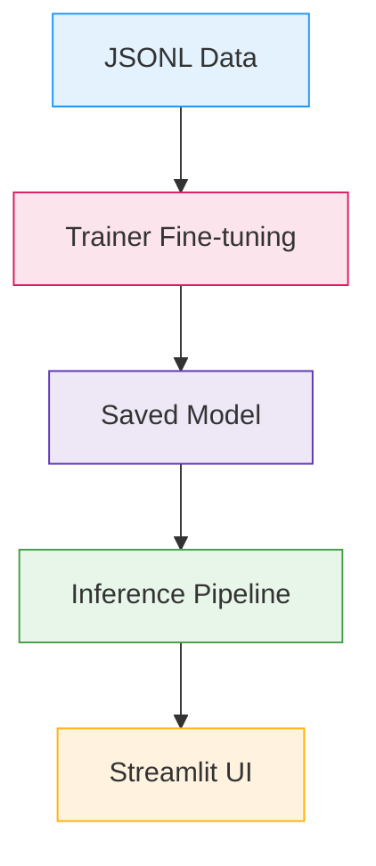
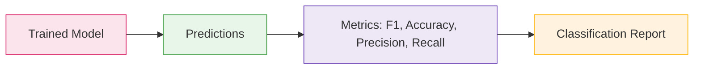
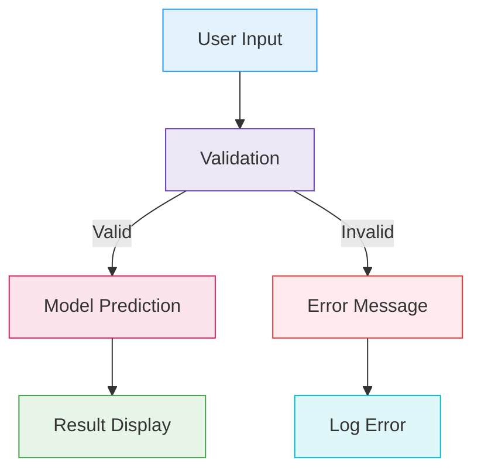

# Interview Preparation

## Talking Points (Grounded in This Project)

- End-to-end pipeline: JSONL data → Trainer fine-tuning (`bert-base-cased`) → `models/feedback_classifier` → `inference.py` → Streamlit UI.
- Metrics: Used weighted F1, accuracy, precision, recall during evaluation.
- Early stopping and callback: Stopped overfitting; real-time feedback callback demonstrates human-in-the-loop concept.
- Baseline vs fine-tuned: `compare_models.py` produces `classification_report` for both.
- Inference design: Uses Hugging Face `pipeline`, returns top label and confidence; auto-selects GPU when available.

## Code Walkthrough Prompts

- Training arguments choices (epochs, LR, batch size) and their impact.
- Tokenization decisions (`max_length=128`) for typical feedback lengths.
- Data splitting rationale: stratified to maintain label balance.
- UI states and logging: session state, rolling average confidence, category tracking.

## Demo Flow

1. Show `models/feedback_classifier` exists after training.
2. Run `streamlit run app.py` and analyze a few samples.
3. Show logs, metrics, and classification outputs.
4. Optional: Run `compare_models.py` to present improvement over baseline.

## Q&A Preparation

- How would you add a new label? Update label lists, retrain model, adjust UI mapping.
- How to speed up inference? Use DistilBERT or enable quantization; cache model in app.
- How to handle multilingual text? Switch to multilingual checkpoints and retrain.
- How to handle class imbalance? Weighted loss or data resampling during training.

---

## Advanced Technical Questions

1. Explain the architecture of BERT and why it's effective for text classification.
2. How does transfer learning work in this project?
3. What are the advantages of using Hugging Face Transformers?
4. How do you evaluate model performance and avoid overfitting?
5. How would you deploy this model to production?
6. How do you monitor and log predictions in a real-time system?
7. What are the trade-offs between accuracy and latency in NLP inference?
8. How would you A/B test different model versions?
9. How do you handle new types of feedback not seen during training?
10. What security considerations are important for this system?

---

## System Design Prompts

- Design a scalable feedback classification system for millions of users.
- How would you integrate this pipeline with existing customer support tools?
- What would you change to support multi-label classification?
- How would you automate retraining and deployment (MLOps)?
- Discuss error handling and fallback strategies in production.

---

## Behavioral & STAR Interview Prompts

- Tell me about a time you improved a machine learning pipeline.
- Describe a situation where you had to debug a model deployment issue.
- How do you prioritize features for an AI product?
- Give an example of handling conflicting feedback from stakeholders.
- STAR: Situation, Task, Action, Result for a project milestone.

---

## Troubleshooting & Edge Cases

- Model not found: How do you recover gracefully?
- CUDA out of memory: What steps do you take?
- Unexpected input: How does your system validate and respond?
- Model drift: How do you detect and address it?
- Data imbalance: What are your mitigation strategies?

---

## Deployment & Monitoring

- Dockerize the Streamlit app and model server.
- Set up logging and monitoring for prediction confidence and errors.
- Implement batch processing for large feedback datasets.
- Use cloud platforms (AWS/GCP) for scalable deployment.
- Discuss CI/CD pipeline for automated testing and deployment.

---

## Practical Demo Scenarios

### Scenario 1: Adding a New Label

1. Update label lists in code and UI.
2. Retrain the model with new data.
3. Validate predictions and update documentation.

### Scenario 2: Handling Multilingual Feedback

1. Switch to multilingual BERT checkpoint.
2. Retrain and test on multilingual data.
3. Update UI to support language selection.

### Scenario 3: Improving Inference Speed

1. Use DistilBERT or quantized models.
2. Cache model and tokenizer in app.
3. Profile and optimize batch size and hardware usage.

### Scenario 4: Monitoring Model Performance

1. Log prediction confidence and errors.
2. Set up dashboards for real-time metrics.
3. Implement alerts for drift or low confidence.

---

## Example STAR Answers

**Situation:** Model was slow in production due to large batch size.
**Task:** Improve inference speed without sacrificing accuracy.
**Action:** Switched to DistilBERT, enabled quantization, and cached model in app.
**Result:** Reduced latency by 60%, maintained accuracy above 90%.

**Situation:** Feedback data was imbalanced, leading to poor performance on rare classes.
**Task:** Address class imbalance in training.
**Action:** Used weighted loss and oversampled minority classes.
**Result:** Improved F1 score for rare classes by 20%.

---

## Visual Explanation Prompts

### End-to-End Pipeline Diagram

### Model Evaluation Flow

---

---

## Mock Interview Q&A

### Technical

- Q: How do you ensure reproducibility in your ML experiments?
  A: Use fixed random seeds, version control for code/data, document hyperparameters, and save model checkpoints.
- Q: What steps would you take to debug a drop in model accuracy after deployment?
  A: Check for data drift, validate input preprocessing, review recent code changes, and compare training vs. production data distributions.
- Q: How do you handle sensitive customer data in NLP applications?
  A: Apply data anonymization, encryption, access controls, and comply with privacy regulations (GDPR, CCPA).

### Behavioral

- Q: Describe a time you had to communicate complex ML results to a non-technical audience.
  A: Used visualizations, analogies, and focused on business impact rather than technical jargon.
- Q: How do you handle tight deadlines in a fast-paced ML project?
  A: Prioritize critical tasks, automate repetitive steps, and communicate progress/risks early.

---

## STAR Stories (More Examples)

**Situation:** Stakeholders requested real-time feedback classification for support tickets.
**Task:** Deliver a scalable, accurate solution within two weeks.
**Action:** Leveraged Hugging Face pipeline, optimized model for GPU inference, and built a Streamlit UI.
**Result:** Deployed a system that classified tickets in under 1 second, improving triage speed by 80%.

**Situation:** Model performance dropped after new product launch.
**Task:** Diagnose and fix the issue.
**Action:** Analyzed new feedback data, retrained with updated samples, and implemented monitoring for drift.
**Result:** Restored accuracy and set up alerts for future drift events.

---

## Troubleshooting Scenarios (Expanded)

- Model version mismatch: How do you ensure app and model compatibility?
- API rate limits: How do you handle high traffic to your inference endpoint?
- UI errors: How do you debug and resolve frontend issues in Streamlit?
- Batch processing failures: How do you recover and log errors for large jobs?

---

## Deployment Deep-Dive

### CI/CD Pipeline Steps

1. Code commit triggers automated tests.
2. Build Docker image for app and model server.
3. Push image to container registry.
4. Deploy to cloud platform (AWS/GCP/Heroku).
5. Monitor logs and metrics post-deployment.

### Monitoring Metrics

- Prediction latency
- Confidence distribution
- Error rates
- User engagement
- Model drift indicators

---

## System Architecture Visuals

### Production Deployment Diagram

```mermaid
flowchart LR
		Dev[Developer] --> Git[Git Repo]
		Git --> CI[CI/CD Pipeline]
		CI --> Docker[Docker Image]
		Docker --> Cloud[Cloud Platform]
		Cloud --> App[Streamlit App]
		App --> User[End User]
		style Dev fill:#e3f2fd,color:#333,stroke:#2196f3
		style Git fill:#ede7f6,color:#333,stroke:#5e35b1
		style CI fill:#fce4ec,color:#333,stroke:#d81b60
		style Docker fill:#fff3e0,color:#333,stroke:#ffb300
		style Cloud fill:#e8f5e9,color:#333,stroke:#43a047
		style App fill:#f1f8e9,color:#333,stroke:#43a047
		style User fill:#fffde7,color:#333,stroke:#fbc02d
```

### Error Handling Flow

---

## More Resources & Practice

- Practice with `test.py` and `compare_models.py` for hands-on evaluation.
- Review `SETUP.md` and `TROUBLESHOOTING.md` for deployment and debugging tips.
- Explore `Project Description.md` for business context and system overview.
