# Project Description

## Overview

The Customer Feedback Analyzer is an end-to-end NLP system that classifies free-form customer feedback into eight actionable categories. It fine-tunes a BERT-based model using the Hugging Face ecosystem and exposes real-time inference through a Streamlit UI. The project demonstrates the full ML lifecycle: data preparation, training, evaluation, comparison against a baseline, deployment artifacts, and a user-facing application.

- **Categories**: `bug`, `feature_request`, `praise`, `complaint`, `question`, `usage_tip`, `documentation`, `other`
- **Core Model**: `bert-base-cased` (fine-tuned for sequence classification)
- **Interface**: Streamlit web app with live metrics and logs
- **Artifacts**: Saved model at `models/feedback_classifier`, evaluation reports, and code modules

## Objectives

- **Automate triage** of customer feedback into standardized categories.
- **Provide a reproducible training pipeline** with clear arguments and metrics.
- **Enable real-time inference** via a user-friendly Streamlit UI.
- **Quantify improvements** over a non-fine-tuned baseline.

## Key Features

- **Fine-Tuning Pipeline**: Hugging Face Trainer with early stopping and weighted F1 for model selection.
- **Inference Module**: GPU-aware pipeline returning label + confidence.
- **Streamlit UI**: Guided workflow, logs, rolling metrics, and usability-focused design.
- **Model Comparison**: Baseline (`bert-base-cased`) vs fine-tuned evaluation using scikit-learn `classification_report`.
- **Data Handling**: Stratified split and JSONL ingestion.

## System Architecture

1. Data ingestion (JSONL with `text`, `label`)
2. Tokenization and label mapping
3. Fine-tuning BERT for classification
4. Save model to `models/feedback_classifier`
5. Evaluate and compare against baseline
6. Serve inference through `inference.py` and UI via `app.py`

### Architecture Diagram (Mermaid)

```mermaid
flowchart LR
    classDef source fill:#E3F2FD,stroke:#2196F3,color:#0D47A1,stroke-width:2px
    classDef process fill:#FFF8E1,stroke:#FFC107,color:#4E342E,stroke-width:2px
    classDef model fill:#E8F5E9,stroke:#4CAF50,color:#1B5E20,stroke-width:2px
    classDef deploy fill:#F3E5F5,stroke:#9C27B0,color:#4A148C,stroke-width:2px
    classDef ui fill:#FFEBEE,stroke:#E53935,color:#B71C1C,stroke-width:2px

    A[JSONL Labeled Data\ntext,label]:::source --> B[Tokenize + Map Labels]:::process --> C[Fine-tune BERT]:::model --> D[Saved Model\nmodels/feedback_classifier]:::model --> E[Evaluate + Compare]:::process --> F[Inference Module\ninference.py]:::deploy --> G[Streamlit UI\napp.py]:::ui
```

## Data & Labels

- **Format**: JSON Lines; one record per line with fields `text` (string) and `label` (string from the 8 classes).
- **Stratified Split**: Ensures balanced label distribution across train/test.
- **Label Mappings**: `label2id` and `id2label` are defined for consistent training/inference.

## Training Pipeline

- **Model**: `bert-base-cased`
- **Tokenization**: truncation with `max_length=128`
- **Arguments**: conservative learning rate (1e-5), batch size 8, 5 epochs, per-epoch evaluation/saving
- **Callbacks**: Early stopping (patience=3) and optional feedback callback for misclassification review
- **Metrics**: weighted F1 for model selection; accuracy, precision, recall for reporting

## Inference

- **Mechanism**: Hugging Face `pipeline("text-classification")`
- **Device**: Auto-selects GPU if available; otherwise CPU
- **Output**: Top label and confidence

## Streamlit UI

- **Features**: Model presence check, training trigger, input form, logs panel, rolling metrics (total analyzed, categories seen, avg confidence)
- **UX**: Polished layout with clear status feedback and error handling

## Model Comparison

- **Baseline**: Non-fine-tuned `bert-base-cased`
- **Fine-tuned**: `models/feedback_classifier`
- **Report**: `classification_report` per class and overall metrics

## File Map (Relevant)

- `code/customer-feedback-analyzer/finetune_classifier.py`: Training pipeline
- `code/customer-feedback-analyzer/inference.py`: Prediction interface
- `code/customer-feedback-analyzer/app.py`: Streamlit application
- `code/customer-feedback-analyzer/compare_models.py`: Baseline vs fine-tuned evaluation
- `code/customer-feedback-analyzer/split_train_test.py`: Stratified splitting

## How to Run

1. Install: `pip install -r code/customer-feedback-analyzer/requirements.txt`
2. Train: `python code/customer-feedback-analyzer/finetune_classifier.py`
3. UI: `streamlit run code/customer-feedback-analyzer/app.py`

## Notes

- Ensure `models/feedback_classifier` exists before inference; otherwise train first.
- Larger datasets and more epochs can improve performance; monitor for overfitting.
