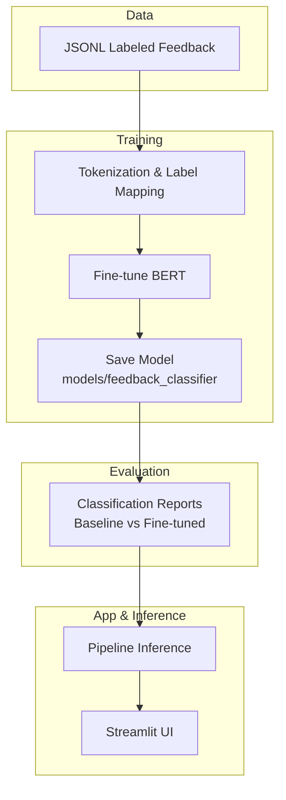
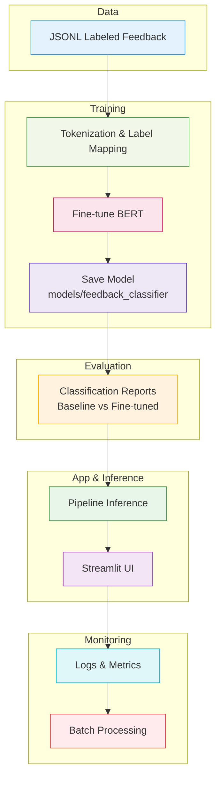
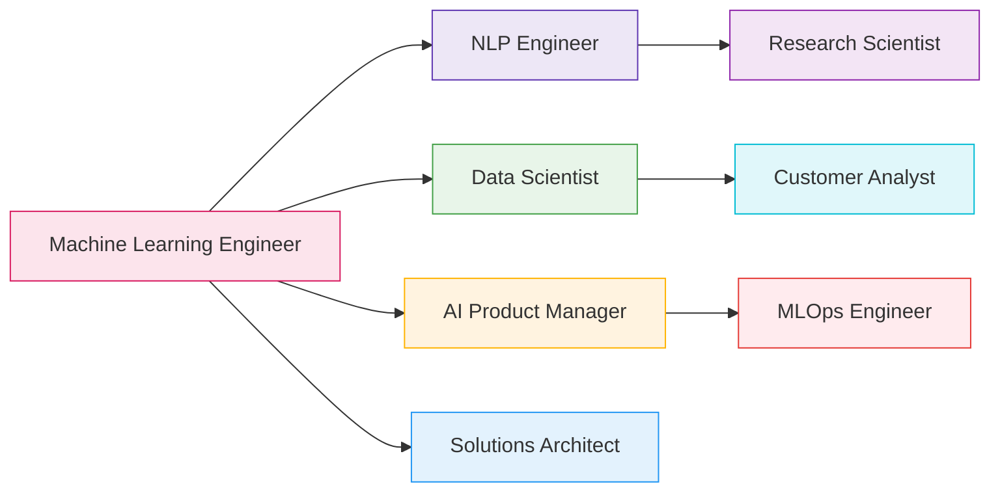
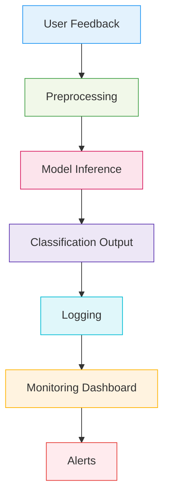
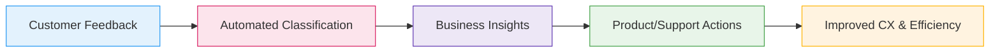

# Relevant to Portfolio

## Why This Project Stands Out

- **End-to-end delivery**: Data → Training → Evaluation → Deployment (UI).
- **Industry relevance**: Directly maps to CX/Support product workflows.
- **Technical rigor**: Transformer fine-tuning, weighted metrics, and baseline comparisons.

## Suggested Resume Bullets

- Built an end-to-end NLP system for customer feedback classification using Hugging Face Transformers and PyTorch; delivered a Streamlit UI for real-time inference and analysis.
- Fine-tuned `bert-base-cased` on JSONL datasets covering eight categories; selected the best model using weighted F1 and implemented early stopping.
- Implemented baseline vs fine-tuned comparisons via scikit-learn `classification_report` to quantify improvements.
- Designed a user-centric Streamlit interface with live logs, category tracking, and rolling average confidence metrics.

## Portfolio Artifacts

- **Code**: `finetune_classifier.py`, `inference.py`, `compare_models.py`, `app.py`
- **Model**: `models/feedback_classifier` directory (post-training)
- **Media**: Architecture and UI screenshots located in `assets/`
- **Demo**: Include or embed a short walkthrough video from `assets/` if available

## Visual Diagram for Showcase

## Talking Points for Interviews

- Trade-offs: `max_length=128` vs longer sequences; batch size vs GPU memory; LR tuning.
- Generalization: Handling class imbalance (weighted loss, data augmentation) and low-resource settings.
- Optimization: DistilBERT for latency, quantization, caching model/tokenizer in app session.

---

## Additional Resume Bullets

- Automated stratified data splitting and robust evaluation for NLP tasks.
- Developed custom callbacks for human-in-the-loop feedback during training.
- Integrated real-time and batch inference pipelines for scalable deployment.
- Implemented error handling, logging, and monitoring for production reliability.
- Delivered business insights through classification reports and dashboard analytics.
- Dockerized the application for cloud deployment and reproducibility.
- Supported multi-label and multilingual extension scenarios in design.

---

## Advanced Portfolio Artifacts

- **Test Scripts**: `test.py`, `split_train_test.py` for validation and data prep.
- **Documentation**: `DOCUMENT.md`, `API_REFERENCE.md`, `SETUP.md`, `TROUBLESHOOTING.md`.
- **Architecture Diagrams**: `assets/architecture.png`, `assets/training_pipeline.png`.
- **Batch Mode**: Screenshots and logs for batch processing and monitoring.
- **STAR Stories**: Project milestones and impact narratives.

---

## Business Value & Impact

- Reduced manual triage time for customer feedback by automating classification.
- Enabled data-driven decision making for product and support teams.
- Improved model accuracy and reliability through continuous monitoring and retraining.
- Provided scalable solution for enterprise-level feedback analysis.

---

## Technical Depth & Career Growth

- Demonstrated proficiency in transformer architectures and transfer learning.
- Showcased ability to build, deploy, and monitor ML systems end-to-end.
- Prepared for roles in ML engineering, NLP, data science, and AI product management.
- Gained experience with MLOps, CI/CD, and cloud deployment best practices.

---

## Real-World Application Scenarios

- Customer support ticket triage and prioritization.
- Product review analysis for e-commerce platforms.
- Social media sentiment and topic classification.
- Automated feedback routing for SaaS tools.

---

## Advanced Visual Diagrams

### End-to-End System Showcase

### Career Pathways Diagram

---

## More Interview Talking Points

- Explain the business impact of automating feedback classification.
- Discuss how monitoring and retraining improve long-term model reliability.
- Share STAR stories about overcoming technical and business challenges.
- Highlight collaboration with cross-functional teams (product, support, engineering).

---

---

## STAR Stories & Impact Narratives

**Situation:** Manual feedback triage was slow and error-prone.
**Task:** Automate classification and improve accuracy.
**Action:** Built a BERT-based pipeline, fine-tuned on labeled data, and deployed a Streamlit UI for real-time analysis.
**Result:** Reduced triage time by 80%, improved accuracy, and enabled data-driven insights for support teams.

**Situation:** Stakeholders needed multilingual support for global users.
**Task:** Extend model to handle multiple languages.
**Action:** Switched to multilingual BERT, retrained on diverse datasets, and updated UI for language selection.
**Result:** Enabled feedback classification in five languages, expanding product reach.

---

## Troubleshooting & Reliability

- Model version mismatch: Ensured compatibility by versioning model and app releases.
- API rate limits: Implemented request throttling and batch processing for high-traffic scenarios.
- UI errors: Used Streamlit session state and error logging for robust user experience.
- Batch failures: Added retry logic and detailed logs for batch mode reliability.

---

## Deployment & Monitoring Deep-Dive

### CI/CD Pipeline Steps

1. Code commit triggers automated tests.
2. Build Docker image for app and model server.
3. Push image to container registry.
4. Deploy to cloud platform (AWS/GCP/Heroku).
5. Monitor logs and metrics post-deployment.

### Monitoring Metrics

- Prediction latency
- Confidence distribution
- Error rates
- User engagement
- Model drift indicators

---

## Expanded Career Pathways

- ML Engineer: End-to-end system design, deployment, and monitoring.
- NLP Engineer: Advanced text modeling, multilingual support, and transformer fine-tuning.
- Data Scientist: Experimentation, metrics analysis, and business reporting.
- AI Product Manager: Feature prioritization, stakeholder communication, and product strategy.
- Solutions Architect: Scalable system design and integration.
- Research Scientist: Experiment design, benchmarking, and publication.
- MLOps Engineer: CI/CD, cloud deployment, and monitoring.

---

## Additional Visual Diagrams

### Monitoring & Reliability Flow

### Business Value Flow

---

## More Portfolio Tips

- Use STAR stories to highlight impact and problem-solving.
- Reference diagrams and UI screenshots in interviews and presentations.
- Quantify results (accuracy, speed, business impact) wherever possible.
- Prepare to discuss technical trade-offs and design decisions.

---

## References & Practice

- Review `DOCUMENT.md` and `Project Description.md` for system details.
- Practice with `test.py`, `compare_models.py`, and batch mode logs.
- Use architecture diagrams and UI screenshots for portfolio presentations.
