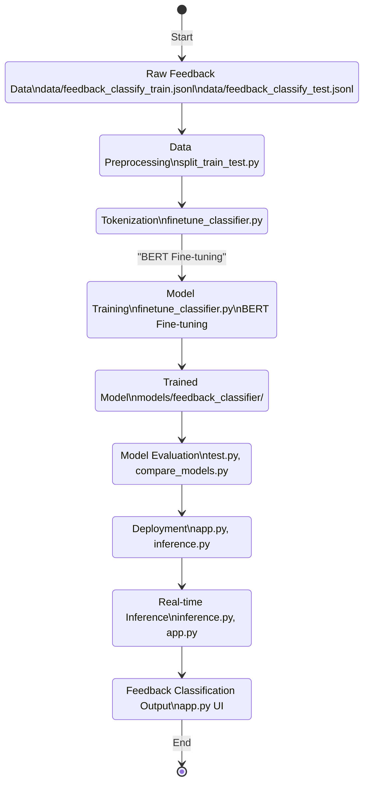

**File Flow Explanation:**

- Raw feedback data is preprocessed and tokenized.
- The tokenized data is used to fine-tune the BERT model.
- The trained model is evaluated and then deployed.
- The deployed model performs real-time inference and outputs classified feedback.
